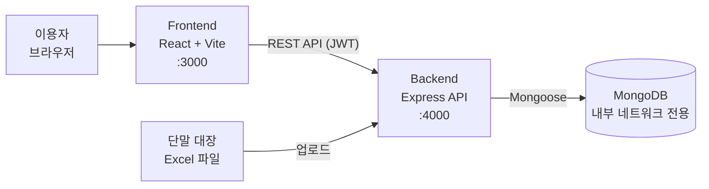

[日本語](README.md) | [한국어](README.ko.md)

# DeviceRent — 테스트 단말 대여 관리 시스템

## 개요

QA 부서에서 사용하는 테스트 단말의 대여·반납·재고 상황을 관리하는 웹 시스템입니다.
개인으로 기획·설계·구현을 진행했고, 부서의 정식 시스템으로 채택되어 현재도 운용 중입니다.

**제작자: ユ・ギヒョン**(기획·설계·구현·운용을 모두 담당)

> 본 리포지토리는 포트폴리오 공개용으로 정리한 것입니다. 사내 데이터(단말 대장, 로그, 네트워크 정보 등)는 모두 제거했습니다.

## 도입 배경

- 이전에는 종이 대장으로 대여를 관리하고 있어서, 업무 시작 시간에 대여 수속을 위해 3~4명이 줄을 서는 상황이 발생했습니다.
- 누가 어느 단말을 빌리고 있는지는 대장을 직접 확인해야 파악할 수 있어, 단말의 소재 확인에 손이 많이 갔습니다.

## 도입 효과

- 각자 브라우저에서 직접 대여·반납할 수 있게 되어, **업무 시작 시간의 대기 줄을 해소**했습니다.
- 대여 상황을 실시간으로 일람할 수 있게 되어, **소재 확인의 수고를 해소**했습니다.
- 이용 규모: QA실 약 40명(3팀)이 이용, 테스트 단말 약 130대(Android / iOS)를 관리하고 있습니다.

## 주요 기능

### 권한 관리
- 직위에 따른 5단계의 권한 레벨(`roleLevel`)과 관리자 플래그(`isAdmin`)에 의한 권한 제어
  - 일반 사용자: 단말 검색·대여·본인이 대여한 단말의 반납·이력 열람
  - 관리자: 사용자 승인, 단말 관리, 대시보드, 각종 익스포트
  - 팀 리더 이상: 장기 대여의 승인·거절
- 사용자 등록은 관리자의 승인제(승인 전에는 로그인 불가, 거절·삭제 시에는 사유와 함께 기록)
- JWT 인증(bcrypt에 의한 패스워드 해시화)
- Microsoft Entra ID(Microsoft 365 계정)에 의한 싱글 사인온(환경변수를 설정한 경우에만 유효)

### 대여·반납
- 단말의 검색, 대여(비고 입력 가능), 반납
- 반납 시에 단말 상태(이용 가능 / 수리 / 사용 중지)와 사유를 등록
- 본인이 빌린 단말만 반납 가능

### 장기 대여 승인 플로우
- 대여 시에 「통상 대여」 또는 「장기 대여」를 선택
- 장기 대여는 즉시 대여한 뒤 「승인 대기」가 되고, 팀 리더 이상이 승인·거절
- 거절된 경우에는 통상 대여로 전환(72시간을 넘기면 회수 대상으로 집계)

### 단말 정보의 제보(변경 신청)
- 일반 사용자가 「OS 버전 변경」, 「수리 필요」를 제보하고, 관리자가 승인하면 단말 정보에 반영
- 승인 대기 중인 제보가 있는 단말은 대여 대상에서 제외

### 관리자 기능
- 단말의 개별 등록·삭제·상태 변경·상세 스펙(제조사, 칩셋, 메모리, 해상도 등)의 편집
- Excel 대장의 업로드에 의한 단말 마스터의 일괄 갱신(차분 갱신 / 강제 초기화)
- 단말별 대여 이력의 참조(페이지네이션 대응)
- 상태 변경·상세 정보 편집·Excel 임포트의 변경 로그

### 대시보드
- 전체 대수, 대여 가능, 대여 중, 장기 대여(승인 완료 / 승인 대기), 점검·사용 중지의 집계
- OS별·상태별의 분포
- 72시간 이상 반납되지 않은 단말(승인 완료된 장기 대여는 제외)의 검출과 경과 시간순 일람
- 최근의 단말 변경 이력

### 이력·Excel 출력
- 대여·반납 이력의 열람과 검색
- 기간 지정(1주일 / 1개월 / 임의 기간)에 의한 이력 Excel 출력(월별 시트)
- 단말 일람의 Excel 출력, 익스포트 실행 이력의 관리
- 보존 기간(2년)을 넘긴 이력을 자동으로 Excel로 내보낸 뒤 DB에서 삭제

## 기술 스택

| 구분 | 기술 |
| --- | --- |
| Frontend | React 19 / Vite 5 / React Router 7 / Tailwind CSS 4 / axios / react-datepicker / SheetJS (xlsx) / file-saver |
| Backend | Node.js 18 / Express 4 / Mongoose 8 / jsonwebtoken / bcrypt / multer / SheetJS (xlsx) / dotenv / cors |
| Database | MongoDB |
| Infra | Docker / Docker Compose |
| Test | Jest 29 / Supertest 7 / mongodb-memory-server 10 / jest-mongoose-mock / jest-html-reporters / jest-allure2-reporter |
| Docs | JSDoc |

## 시스템 구성



- 3개의 서비스를 Docker Compose로 구성하고, MongoDB는 호스트에 포트를 공개하지 않고 컨테이너 간 통신으로만 한정하고 있습니다.
- MongoDB의 헬스 체크 완료 후에 Backend가 기동하도록 의존 관계를 설정하고 있습니다.

## 설계상의 고안

### 조건부 갱신에 의한 이중 대여 방지
대여 처리는 「단말을 검색 → 비어 있으면 갱신」이라는 2단계가 아니라, `findOneAndUpdate` 의 검색 조건에 `rentedBy: null` 과 `status: 'active'` 를 포함시킨 **단일한 원자적 갱신**으로 수행하고 있습니다.
여러 명이 동시에 같은 단말을 빌리려고 해도 성공하는 것은 1건뿐이며, 그 외에는 `409 Conflict` 를 반환합니다. 반납도 동일하게 `rentedBy.name` 을 조건에 포함시켜, 타인의 단말을 반납할 수 없도록 하고 있습니다.

```js
const device = await Device.findOneAndUpdate(
  { serialNumber: deviceId, rentedBy: null, status: 'active' },
  { $set: { rentedBy: { name: user.name, affiliation: user.affiliation }, rentedAt, ... } },
  { new: true }
);
```

장기 대여의 승인·거절도 `longTermStatus: 'pending'` 을 조건으로 한 조건부 갱신으로 해서, 승인과 반납이 경합한 경우에도 불일치가 발생하지 않도록 하고 있습니다.

### 대여 중 단말의 삭제를 백엔드에서도 차단
화면에서 삭제 버튼을 비활성화하는 것뿐만 아니라, API 측에서도 `findOneAndDelete({ serialNumber, rentedBy: null })` 로 함으로써, API를 직접 호출한 경우에도 대여 중인 단말은 삭제할 수 없습니다(`409` 를 반환).

### Excel 임포트 시의 운용 데이터 보호
Excel 대장에 의한 차분 갱신에서는, 대여 중인 단말의 상태·대여 정보를 덮어쓰지 않고 스펙 정보만을 갱신합니다(`bulkWrite` + `upsert`). 시리얼 번호의 중복이 있는 경우에는 임포트 자체를 중지합니다.

### 권한 체크를 서버 측에서 일원화
화면의 메뉴 표시 제어에 더해, `adminAuth` / `requireRoleLevel(n)` 등의 미들웨어로 API별로 권한을 검증하고 있습니다. 토큰의 내용만을 신뢰하지 않고, 요청마다 DB의 사용자 정보(승인 상태·권한)를 확인하고 있습니다.

### 이력 데이터의 보전
- 대여 이력에 대한 `PUT` / `PATCH` / `DELETE` 는 `405` 를 반환하고, 읽기 전용으로 하고 있습니다.
- DB 사용률이 95%를 넘은 경우에는 대여·반납을 `503` 으로 정지하고, 데이터 결손을 방지합니다.
- 2년을 넘긴 이력은 Excel로 내보낸 뒤 삭제하고, 내보내기의 실행 이력을 기록하고 있습니다.

### 환경변수에 의한 비밀 정보의 관리
`JWT_SECRET` 은 환경변수로 필수로 하고, 미설정인 경우에는 서버를 기동시키지 않습니다(테스트 환경에서만 고정값을 허용). CORS의 허가 오리진도 환경변수로 설정합니다.

## 테스트

백엔드의 API를 중심으로, **22개의 테스트 파일·155케이스**를 작성했고 전부 통과합니다.
테스트용 MongoDB는 인메모리로 기동하므로, 외부의 DB를 준비하지 않고 실행할 수 있습니다.

| 구성 | 내용 |
| --- | --- |
| 테스트 러너 | Jest 29 |
| HTTP 테스트 | Supertest(Express 앱에 직접 요청) |
| DB | mongodb-memory-server(`globalSetup` 에서 인메모리 MongoDB를 기동), 일부는 jest-mongoose-mock에 의한 모킹 |
| 리포트 | 커버리지(lcov / HTML), jest-html-reporters, Allure |

주요 테스트 대상:

- `tests/routes/devices/` — 대여·반납·이중 대여의 방지, 장기 대여의 승인 권한, 대시보드 집계, 단말 관리·삭제 제어 등(10개 파일)
- `tests/routes/auth/`, `tests/routes/admin/` — 사용자 등록·로그인·승인
- `tests/server/` — 단말 초기화, 데이터 정합성 체크, 보존 기간 초과 데이터의 내보내기 등(9개 파일)
- `tests/utils/` — Excel 대장의 파싱 처리

```bash
cd backend
npm install
npm test
```

## 셋업

### 전제
- Docker / Docker Compose

### Docker Compose로 기동

```bash
# 1. 환경변수 파일을 작성하고, JWT_SECRET 에 임의의 충분히 긴 문자열을 설정
cp .env.example .env

# 2. 빌드하고 기동
docker compose up --build
```

- Frontend: http://localhost:3000
- Backend API: http://localhost:4000
- MongoDB는 최초 기동 시에 `init-mongo.js` 로 샘플 단말 2대가 등록됩니다.

`docker-compose.yml` 이 참조하는 환경변수(`.env` 에 기재):

| 변수 | 필수 | 설명 |
| --- | --- | --- |
| `JWT_SECRET` | ○ | JWT 서명용 비밀키 |
| `ALLOWED_ORIGINS` | | CORS 허가 오리진(콤마 구분, 기본값 `http://localhost:3000`) |
| `VITE_API_URL` | | Frontend에서의 API 접속 대상(미설정 시에는 접속 중인 호스트의 `:4000`) |
| `MICROSOFT_TENANT_ID` / `MICROSOFT_CLIENT_ID` / `MICROSOFT_CLIENT_SECRET` / `MICROSOFT_REDIRECT_URI` | | Microsoft 365 로그인을 사용하는 경우에만 |

### 최초 관리자 계정 작성

사용자 등록은 관리자의 승인제이므로, 최초의 관리자만 DB에서 직접 승인합니다.

1. http://localhost:3000/register 에서, 직위를 관리자 권한이 있는 직책(파트 리더 이상)으로 해서 등록
2. 아래 명령으로 승인 상태로 변경

```bash
docker compose exec mongo mongosh devicerental --eval 'db.users.updateOne({ id: "<등록한 ID>" }, { $set: { isPending: false } })'
```

### 로컬에서 개별로 기동하는 경우

MongoDB를 별도로 기동한 뒤, Backend용 `.env` 를 작성하고 `MONGODB_URI` 와 `JWT_SECRET` 을 환경에 맞춰 설정해 주세요.

```bash
# Backend(dotenv 는 backend 디렉터리의 .env 를 읽어들입니다)
cp .env.example backend/.env
cd backend
npm install
npm start

# Frontend(별도 터미널)
cd frontend
npm install
npm start
```

## 문서

- [역기획서(시스템 사양서)](docs/DeviceRent_ReverseSpec_ko.md) — 권한, 업무 플로우, 데이터 모델, API 일람

## 개발 기간

2025년 3월 ~ 2026년 9월(최초 커밋: 2025-03-01, 최신 커밋: 2026-09-09)

운용 개시 후에도 이용자의 피드백을 바탕으로 장기 대여 승인 플로우, 대시보드, 단말 정보의 제보 기능 등을 계속적으로 추가하고 있습니다.

## 향후 과제

- 모바일 전용 화면(단말 종류에 따른 화면 분기, Quagga에 의한 바코드 읽기 UI)은 시작 단계이며, 대여·반납 API와의 접속은 미완성입니다.
