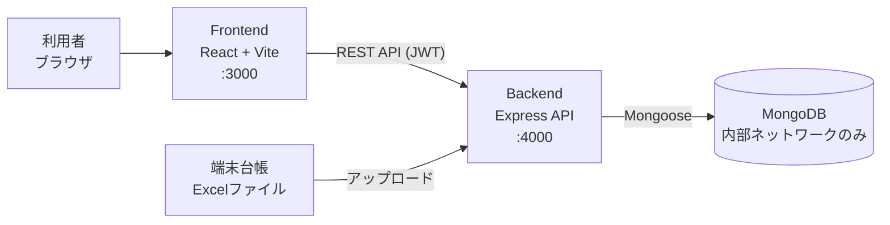

# DeviceRent — テスト端末 貸出管理システム

## 概要

QA部署で使用するテスト端末の貸出・返却・在庫状況を管理するWebシステムです。
個人で企画・設計・実装を行い、部署の正式システムとして採用され、現在も運用中です。

> 本リポジトリはポートフォリオ公開用に整理したものです。社内データ（端末台帳、ログ、ネットワーク情報等）はすべて除去しています。

## 導入背景

- 以前は紙の台帳で貸出を管理しており、始業時には貸出手続きのために3〜4人が列に並ぶ状況が発生していました。
- 誰がどの端末を借りているかは台帳を直接確認しないと把握できず、端末の所在確認に手間がかかっていました。

## 導入効果

- 各自がブラウザから直接貸出・返却できるようになり、**始業時の待ち行列を解消**しました。
- 貸出状況をリアルタイムに一覧で確認できるようになり、**所在確認の手間を解消**しました。
- 利用規模：QA室 約40名（3チーム）が利用、テスト端末 約130台（Android / iOS）を管理しています。

## 主な機能

### 権限管理
- 職位に応じた5段階の権限レベル（`roleLevel`）と管理者フラグ（`isAdmin`）による権限制御
  - 一般ユーザー：端末の検索・貸出・自身の貸出端末の返却・履歴閲覧
  - 管理者：ユーザー承認、端末管理、ダッシュボード、各種エクスポート
  - チームリーダー以上：長期貸出の承認・却下
- ユーザー登録は管理者の承認制（承認前はログイン不可、却下・削除時は理由とともに記録）
- JWT認証（bcryptによるパスワードハッシュ化）
- Microsoft Entra ID（Microsoft 365アカウント）によるシングルサインオン（環境変数を設定した場合のみ有効）

### 貸出・返却
- 端末の検索、貸出（備考入力可）、返却
- 返却時に端末状態（利用可能 / 修理 / 使用停止）と理由を登録
- 本人が借りている端末のみ返却可能

### 長期貸出承認フロー
- 貸出時に「通常貸出」または「長期貸出」を選択
- 長期貸出は即時に貸し出したうえで「承認待ち」となり、チームリーダー以上が承認・却下
- 却下された場合は通常貸出に切り替え（72時間を超えると回収対象として集計）

### 端末情報の報告（変更申請）
- 一般ユーザーが「OSバージョン変更」「修理が必要」を報告し、管理者が承認すると端末情報に反映
- 承認待ちの報告がある端末は貸出対象から除外

### 管理者機能
- 端末の個別登録・削除・状態変更・詳細スペック（メーカー、チップセット、メモリ、解像度など）の編集
- Excel台帳のアップロードによる端末マスタの一括更新（差分更新 / 強制初期化）
- 端末ごとの貸出履歴の参照（ページネーション対応）
- 状態変更・詳細情報編集・Excel取り込みの変更ログ

### ダッシュボード
- 全台数、貸出可能、貸出中、長期貸出（承認済み / 承認待ち）、点検・使用停止の集計
- OS別・状態別の分布
- 72時間以上返却されていない端末（承認済み長期貸出を除く）の検出と経過時間順の一覧
- 最近の端末変更履歴

### 履歴・Excel出力
- 貸出・返却履歴の閲覧と検索
- 期間指定（1週間 / 1か月 / 任意期間）での履歴Excel出力（月別シート）
- 端末一覧のExcel出力、エクスポート実行履歴の管理
- 保存期間（2年）を超えた履歴を自動でExcelに退避したうえでDBから削除

## 技術スタック

| 区分 | 技術 |
| --- | --- |
| Frontend | React 19 / Vite 5 / React Router 7 / Tailwind CSS 4 / axios / react-datepicker / SheetJS (xlsx) / file-saver |
| Backend | Node.js 18 / Express 4 / Mongoose 8 / jsonwebtoken / bcrypt / multer / SheetJS (xlsx) / dotenv / cors |
| Database | MongoDB |
| Infra | Docker / Docker Compose |
| Test | Jest 29 / Supertest 7 / mongodb-memory-server 10 / jest-mongoose-mock / jest-html-reporters / jest-allure2-reporter |
| Docs | JSDoc |

## システム構成



- 3つのサービスを Docker Compose で構成し、MongoDB はホストにポートを公開せず、コンテナ間通信のみに限定しています。
- MongoDB のヘルスチェック完了後に Backend が起動するよう依存関係を設定しています。

## 設計上の工夫

### 条件付き更新による二重貸出の防止
貸出処理は「端末を検索 → 空いていれば更新」という2段階ではなく、`findOneAndUpdate` の検索条件に `rentedBy: null` と `status: 'active'` を含めた**単一のアトミックな更新**で行っています。
複数人が同時に同じ端末を借りようとしても、成功するのは1件のみで、それ以外は `409 Conflict` を返します。返却も同様に `rentedBy.name` を条件に含め、他人の端末を返却できないようにしています。

```js
const device = await Device.findOneAndUpdate(
  { serialNumber: deviceId, rentedBy: null, status: 'active' },
  { $set: { rentedBy: { name: user.name, affiliation: user.affiliation }, rentedAt, ... } },
  { new: true }
);
```

長期貸出の承認・却下も `longTermStatus: 'pending'` を条件にした条件付き更新とし、承認と返却が競合した場合でも不整合が起きないようにしています。

### 貸出中端末の削除をバックエンドでも遮断
画面上で削除ボタンを無効化するだけでなく、API側でも `findOneAndDelete({ serialNumber, rentedBy: null })` とすることで、APIを直接呼び出された場合でも貸出中の端末は削除できません（`409` を返却）。

### Excel取り込み時の運用データ保護
Excel台帳による差分更新では、貸出中の端末の状態・貸出情報を上書きせず、スペック情報のみを更新します（`bulkWrite` + `upsert`）。シリアル番号の重複がある場合は取り込み自体を中止します。

### 権限チェックをサーバー側で一元化
画面のメニュー表示制御に加え、`adminAuth` / `requireRoleLevel(n)` などのミドルウェアでAPIごとに権限を検証しています。トークンの内容だけを信用せず、リクエストごとにDBのユーザー情報（承認状態・権限）を確認しています。

### 履歴データの保全
- 貸出履歴への `PUT` / `PATCH` / `DELETE` は `405` を返し、読み取り専用としています。
- DB使用率が95%を超えた場合は貸出・返却を `503` で停止し、データ欠損を防ぎます。
- 2年を超えた履歴はExcelに退避してから削除し、退避の実行履歴を記録しています。

### 環境変数による秘密情報の管理
`JWT_SECRET` は環境変数で必須とし、未設定の場合はサーバーを起動させません（テスト環境のみ固定値を許可）。CORSの許可オリジンも環境変数で設定します。

## テスト

バックエンドのAPIを中心に、**22個のテストファイル**（約150ケース）を作成しています。

| 構成 | 内容 |
| --- | --- |
| テストランナー | Jest 29 |
| HTTPテスト | Supertest（Express アプリに直接リクエスト） |
| DB | mongodb-memory-server（テストごとにインメモリのMongoDBを起動）、一部は jest-mongoose-mock によるモック |
| レポート | カバレッジ（lcov / HTML）、jest-html-reporters、Allure |

主なテスト対象：

- `tests/routes/devices/` — 貸出・返却・二重貸出の防止、長期貸出の承認権限、ダッシュボード集計、端末管理・削除制御など（10ファイル）
- `tests/routes/auth/`, `tests/routes/admin/` — ユーザー登録・ログイン・承認
- `tests/server/` — 端末初期化、データ整合性チェック、保存期間超過データの退避など（9ファイル）
- `tests/utils/` — Excel台帳のパース処理

```bash
cd backend
npm install
npm test
```

## セットアップ

### 前提
- Docker / Docker Compose

### Docker Compose で起動

```bash
# 1. 環境変数ファイルを作成し、JWT_SECRET に任意の十分に長い文字列を設定
cp .env.example .env

# 2. ビルドして起動
docker compose up --build
```

- Frontend: http://localhost:3000
- Backend API: http://localhost:4000
- MongoDB は初回起動時に `init-mongo.js` でサンプル端末2台が登録されます。

`docker-compose.yml` が参照する環境変数（`.env` に記載）：

| 変数 | 必須 | 説明 |
| --- | --- | --- |
| `JWT_SECRET` | ○ | JWT署名用の秘密鍵 |
| `ALLOWED_ORIGINS` | | CORS許可オリジン（カンマ区切り、既定値 `http://localhost:3000`） |
| `VITE_API_URL` | | FrontendからのAPI接続先（未設定時はアクセス中のホストの `:4000`） |
| `MICROSOFT_TENANT_ID` / `MICROSOFT_CLIENT_ID` / `MICROSOFT_CLIENT_SECRET` / `MICROSOFT_REDIRECT_URI` | | Microsoft 365 ログインを使用する場合のみ |

### 初回の管理者アカウント作成

ユーザー登録は管理者の承認制のため、最初の管理者のみDBで直接承認します。

1. http://localhost:3000/register で、職位を管理者権限のある役職（パートリーダー以上）にして登録
2. 以下のコマンドで承認状態に変更

```bash
docker compose exec mongo mongosh devicerental --eval 'db.users.updateOne({ id: "<登録したID>" }, { $set: { isPending: false } })'
```

### ローカルで個別に起動する場合

MongoDB を別途起動したうえで、Backend 用の `.env` を作成し、`MONGODB_URI` と `JWT_SECRET` を環境に合わせて設定してください。

```bash
# Backend（dotenv は backend ディレクトリの .env を読み込みます）
cp .env.example backend/.env
cd backend
npm install
npm start

# Frontend（別ターミナル）
cd frontend
npm install
npm start
```

## ドキュメント

- [逆企画書（システム仕様書）](docs/DeviceRent_ReverseSpec_ja.md) — 権限、業務フロー、データモデル、API一覧

## 開発期間

2025年3月 〜 2026年9月（初回コミット：2025-03-01、最新コミット：2026-09-09）

運用開始後も、利用者からのフィードバックをもとに長期貸出承認フロー、ダッシュボード、端末情報の報告機能などを継続的に追加しています。

## 今後の課題

- モバイル専用画面（端末種別による画面の振り分け、Quagga によるバーコード読み取りUI）は試作段階であり、貸出・返却APIとの接続は未完成です。
