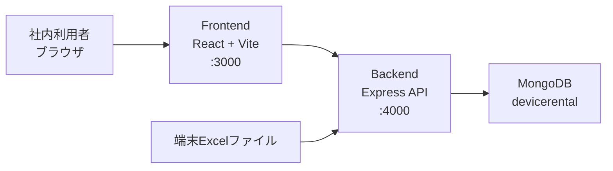
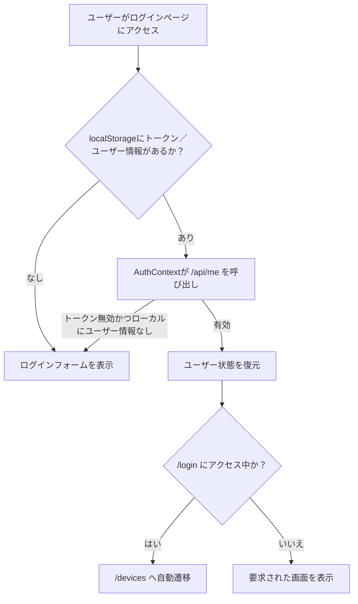
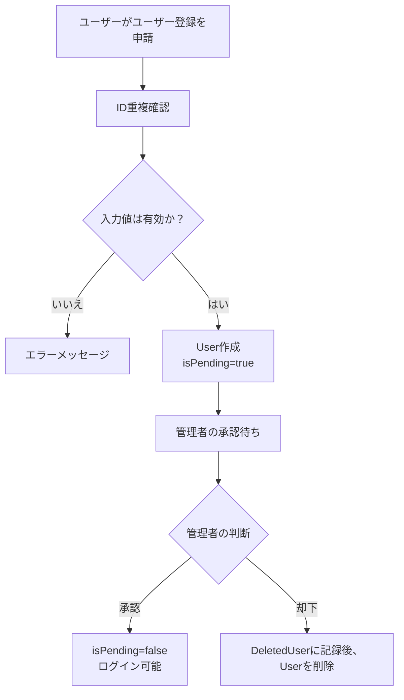
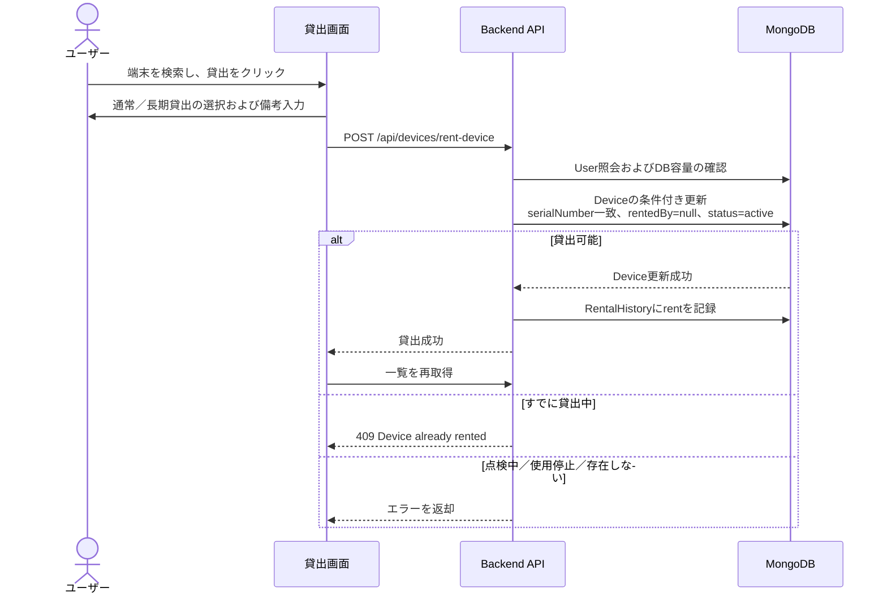
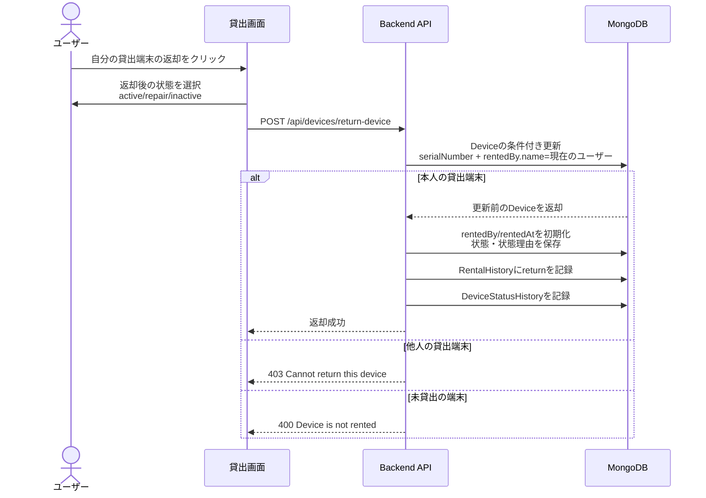
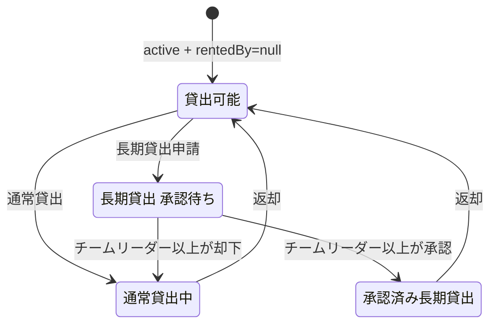
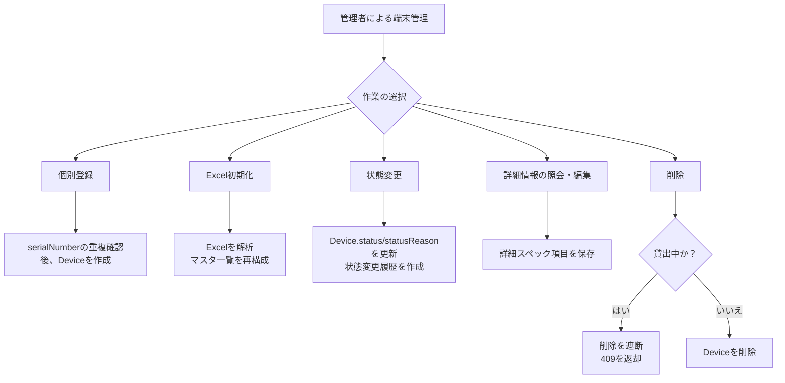

# DeviceRent 逆企画書

作成日：2026-06-16  
対象ソース：現行 `main` ブランチ  
想定読者：運用管理者、開発・QA担当者

## 1. 本書の目的

本書は、現在実装されている DeviceRent システムをもとに、サービスの目的、ユーザー権限、主要な業務フロー、データ構造、API、運用ポリシーを逆企画の観点から整理したものである。新任運用者のオンボーディング、機能検収、リリース承認、今後の改善範囲の見積もりに活用できるよう、ビジネスロジックを中心に記述する。

## 2. サービス概要

DeviceRent は、社内QA組織におけるモバイル端末の貸出、返却、状況照会、長期貸出の承認、機材管理、貸出履歴の保管を支援するWebベースの資産運用システムである。

主な目標は以下のとおりである。

- 端末ごとの現在の貸出可否を、リアルタイムに近い形で確認できるようにする。
- ユーザーが必要な端末を自ら検索し、直接貸出・返却できるようにする。
- 管理者が全端末の一覧、状態、詳細スペック、Excelベースのマスタデータを管理できるようにする。
- チームリーダー以上の権限者が長期貸出の申請を承認または却下できるようにする。
- 貸出・返却・状態変更の履歴を保存し、必要に応じてExcelで出力できるようにする。

## 3. ユーザーと権限

| 区分 | 主な権限 | アクセス画面 |
| --- | --- | --- |
| 未承認ユーザー | ユーザー登録申請、ID重複確認 | ユーザー登録、ログイン |
| 一般ユーザー | ログイン、端末検索、貸出、自身が貸出中の端末の返却、貸出状況・履歴の照会 | 貸出、貸出状況、貸出履歴 |
| 管理者 | 一般ユーザーの権限 + ユーザーの承認・削除、端末の登録・削除・状態変更・詳細情報編集、Excel初期化、履歴エクスポート | 管理者、端末管理、ユーザー管理、ダッシュボード |
| チームリーダー以上 | 長期貸出の承認・却下 | 承認待ち |

権限はユーザーの `position`、`roleLevel`、`isAdmin` で管理する。

- 管理者APIは `adminAuth` ミドルウェアにより `isAdmin=true` のユーザーを要求する。
- 長期貸出承認APIは `requireRoleLevel(3)` によりチームリーダー以上のユーザーを要求する。
- ログイントークンはJWTであり、有効期限は管理者トークンが365日、一般ユーザートークンが1時間である。

## 4. システム構成



Docker Compose の構成：

- `frontend`：React/Vite アプリ、外部公開ポート `3000`
- `backend`：Express API、外部公開ポート `4000`
- `mongo`：内部ネットワーク専用、外部に `27017` を公開しない
- `mongo-data`：MongoDB の永続化ボリューム

## 5. 主な画面

| 画面 | パス | 主な機能 |
| --- | --- | --- |
| ログイン | `/login` | ログイン。ログイン済みのユーザーは `/devices` へ自動遷移 |
| ユーザー登録 | `/register` | 氏名、所属、ID、パスワード、職位の入力、ID重複確認 |
| 貸出 | `/devices` | 全体／貸出可能／貸出中／自分の貸出のサマリー、端末検索、貸出・返却、詳細情報の照会 |
| 貸出状況 | `/devices/status` | 現在貸出中の端末一覧、サマリーカード、備考の照会 |
| 貸出履歴 | `/devices/history` | 貸出・返却履歴の照会および期間指定でのエクスポート |
| 管理者ホーム | `/admin` | 管理者機能への導線、保存期間を超えた履歴の整理 |
| 端末管理 | `/devices/manage` | 端末の登録・削除・状態変更・詳細情報編集・Excel初期化 |
| ユーザー管理 | `/admin/users`, `/admin/pending` | 承認済みユーザーの照会、登録の承認・却下、ユーザー削除 |
| ダッシュボード | `/dashboard` | 保有総数、貸出中、長期貸出、点検・使用停止、返却遅延の集計 |
| 長期貸出承認 | `/longterm/approvals` | 長期貸出申請の承認・却下 |

## 6. 主要業務フロー

### 6.1 ログインおよびセッション維持



業務ルール：

- ログイン成功時にJWTを保存し、`/api/me` でユーザー情報を再取得する。
- アプリ初期化時、保存済みのトークンがあれば `/api/me` で有効性を検証する。
- ログイン済みのユーザーが `/login` にアクセスした場合は、貸出ページへ遷移する。
- モバイルからログインしたユーザーは `/mobile/rent` へ遷移する。

### 6.2 ユーザー登録および承認



業務ルール：

- 登録時は氏名、所属、ID、パスワード、パスワード確認、職位がすべて必須である。
- IDは3文字以上、パスワードは6文字以上とする。
- 登録直後のアカウントは `isPending=true` であり、ログインできない。
- 管理者が承認することで、正常にログインできるようになる。
- 却下・削除されたユーザーは、削除理由とともに `DeletedUser` に記録される。

### 6.3 端末の貸出



業務ルール：

- 貸出は `status=active` かつ `rentedBy=null` の端末に限り可能である。
- サーバーは `findOneAndUpdate` による条件付き更新で二重貸出を防止する。
- 貸出成功時に `Device.rentedBy`、`rentedAt`、`remark`、`rentalType`、`longTermStatus` が更新される。
- 通常貸出は `rentalType=normal`、`longTermStatus=none` となる。
- 長期貸出は端末を即時に貸出状態にしたうえで、`rentalType=longterm`、`longTermStatus=pending` の承認待ち状態となる。
- 貸出成功時に `RentalHistory` に `action=rent` の記録が作成される。

### 6.4 端末の返却



業務ルール：

- ユーザーは本人名義で貸し出されている端末のみ返却できる。
- 返却時、端末の貸出情報は初期化され、長期貸出の状態も通常状態に戻る。
- 返却後の状態は `active`、`repair`、`inactive` のいずれかで保存される。
- 返却は `RentalHistory`、状態変更は `DeviceStatusHistory` にそれぞれ記録される。

### 6.5 長期貸出の承認



業務ルール：

- 長期貸出の申請者は一般ユーザーと同様に端末を貸し出すが、承認されるまでは `pending` となる。
- チームリーダー以上は、承認待ち一覧から承認・却下を行うことができる。
- 承認時には `longTermStatus=approved`、`approvedBy`、`approvedAt` が保存される。
- 却下時は実際の貸出を維持したまま、`rentalType=normal`、`longTermStatus=none` に戻す。
- ダッシュボードにおける72時間超の返却遅延の集計では、承認済みの長期貸出を除外する。

### 6.6 端末管理



業務ルール：

- 管理者は端末を個別に登録するか、Excelファイルで初期化することができる。
- Excel初期化では、運用中のExcel台帳の主要シートから、シリアル、端末名、OS、端末状態、詳細スペックを読み込む。
- Excel上の端末状態は、システム上の状態に変換される。
  - 利用可能：`active`
  - 修理：`repair`
  - 廃棄／貸出対象外：`inactive`
- 詳細情報には、端末状態、区分、メーカー、型番、チップセット、CPU、GPU、メモリ、Bluetooth、画面サイズ、解像度、登録日、確認日、UDID、備考が含まれる。
- 貸出中の端末は削除できない。バックエンドでは `rentedBy=null` を条件とした場合のみ削除するため、画面を経由しないリクエストも遮断される。
- 管理ページの詳細情報モーダルは、照会後に編集ボタンを押した場合のみ編集状態になる。
- 貸出ページの詳細情報モーダルは照会専用である。

## 7. データモデル

### 7.1 Device

| フィールド | 意味 |
| --- | --- |
| `serialNumber` | 端末の一意識別子 |
| `deviceInfo`, `modelName` | 表示用の端末名／モデル名 |
| `osName`, `osVersion` | OSの種類およびバージョン |
| `rentedBy` | 現在の貸出者の氏名／所属、未貸出時は `null` |
| `rentedAt` | 現在の貸出開始日時 |
| `rentalType` | `normal` または `longterm` |
| `longTermStatus` | `none`、`pending`、`approved` |
| `approvedBy`, `approvedAt` | 長期貸出の承認者／承認日時 |
| `status` | `active`、`repair`、`inactive` |
| `statusReason` | 状態変更の理由 |
| `remark` | 貸出時の備考 |
| `details` | Excelベースの詳細スペック |

### 7.2 User

| フィールド | 意味 |
| --- | --- |
| `id` | ログインID |
| `password` | bcryptでハッシュ化したパスワード |
| `name`, `affiliation` | ユーザーの氏名／所属 |
| `position` | 職位 |
| `roleLevel` | 権限レベル（値が小さいほど上位権限） |
| `isPending` | 管理者の承認待ちかどうか |
| `isAdmin` | 管理者権限の有無 |

### 7.3 RentalHistory

| フィールド | 意味 |
| --- | --- |
| `deviceId`, `serialNumber` | 対象端末 |
| `userId`, `userDetails` | 貸出・返却を行ったユーザー |
| `action` | `rent` または `return` |
| `timestamp` | 実行日時 |
| `deviceInfo` | 当時の端末名／OS情報 |
| `remark` | 貸出時の備考 |

### 7.4 DeviceStatusHistory

| フィールド | 意味 |
| --- | --- |
| `serialNumber` | 対象端末 |
| `modelName`, `osName`, `osVersion` | 当時の端末情報 |
| `status` | 変更後の状態 |
| `statusReason` | 状態変更の理由 |
| `performedBy` | 実行者 |
| `timestamp` | 実行日時 |

## 8. 主なAPI

| 区分 | Method/Path | 用途 | 権限 |
| --- | --- | --- | --- |
| 認証 | `POST /api/auth/register` | ユーザー登録申請 | 公開 |
| 認証 | `POST /api/auth/check-id` | ID重複確認 | 公開 |
| 認証 | `POST /api/auth/login` | ログインおよびJWT発行 | 公開 |
| 認証 | `GET /api/me` | 現在のユーザーの検証 | ログイン |
| 端末 | `GET /api/devices` | 全端末一覧 | ログイン |
| 端末 | `GET /api/devices/available` | 貸出可能端末一覧 | ログイン |
| 端末 | `GET /api/devices/status` | 現在貸出中の端末一覧 | ログイン |
| 貸出 | `POST /api/devices/rent-device` | 端末の貸出 | ログイン |
| 返却 | `POST /api/devices/return-device` | 端末の返却 | ログイン |
| 履歴 | `GET /api/devices/history` | 貸出・返却履歴の照会 | ログイン |
| 履歴 | `POST /api/devices/history/export` | 履歴のExcelエクスポート | ログイン |
| 管理者 | `POST /api/admin/upload-devices` | Excelによる端末初期化 | 管理者 |
| 管理者 | `POST /api/devices/manage/register` | 端末の個別登録 | 管理者 |
| 管理者 | `POST /api/devices/manage/delete` | 端末の削除 | 管理者 |
| 管理者 | `POST /api/devices/manage/update-details` | 詳細情報の編集 | 管理者 |
| 管理者 | `POST /api/devices/manage/update-status` | 端末の状態変更 | ログイントークン（画面上は管理者） |
| 管理者 | `GET /api/admin/users/pending` | 登録承認待ちの照会 | 管理者 |
| 管理者 | `POST /api/admin/users/approve` | ユーザーの承認 | 管理者 |
| 管理者 | `POST /api/admin/users/reject` | ユーザーの却下 | 管理者 |
| 管理者 | `POST /api/admin/users/delete` | ユーザーの削除 | 管理者 |
| ダッシュボード | `GET /api/devices/dashboard` | 運用指標の照会 | 管理者 |
| 長期貸出 | `GET /api/devices/longterm/pending` | 長期貸出の承認待ち照会 | チームリーダー以上 |
| 長期貸出 | `POST /api/devices/longterm/approve` | 長期貸出の承認 | チームリーダー以上 |
| 長期貸出 | `POST /api/devices/longterm/reject` | 長期貸出の却下 | チームリーダー以上 |

## 9. 運用指標の定義

| 指標 | 定義 |
| --- | --- |
| 全体 | Deviceの総数 |
| 貸出可能 | `status=active` かつ `rentedBy=null` の端末 |
| 貸出中 | `rentedBy` が存在する端末 |
| 自分の貸出 | ログインユーザーの氏名と `rentedBy.name` が一致する端末 |
| 点検中／使用停止 | `status=repair` または `status=inactive` の端末 |
| 長期貸出（承認済み） | `rentalType=longterm`、`longTermStatus=approved` |
| 長期貸出（承認待ち） | `rentalType=longterm`、`longTermStatus=pending` |
| 返却遅延 | 貸出から72時間以上経過し、承認済みの長期貸出ではないもの |

## 10. 例外処理および統制ポリシー

| 状況 | 処理 |
| --- | --- |
| トークンなし | 401を返却し、フロントエンドはログイン画面へ遷移 |
| トークン無効 | 401または403を返却 |
| 未承認ユーザーのログイン | 403、承認待ちメッセージを表示 |
| 貸出中の端末への貸出 | 409を返却 |
| 点検中／使用停止の端末への貸出 | 400を返却 |
| 他人が貸出中の端末の返却 | 403を返却 |
| 貸出中の端末の削除 | 409を返却し、削除を遮断 |
| DB使用率95%超過 | 貸出・返却処理を503で遮断 |
| Excelファイルなし | 400を返却 |
| 詳細情報の編集対象なし | 404を返却 |

## 11. ビルドおよび検証結果

2026-06-16 時点のソースをもとに、以下の検証を実施した。

| 項目 | 結果 |
| --- | --- |
| Frontend Vite プロダクションビルド | 成功 |
| Backend 構文チェック | 成功 |
| Backend 管理・削除の回帰テスト | 成功（7件のテストが通過） |
| Docker Compose イメージビルド | 成功（`frontend`／`backend` イメージのビルド完了） |

フロントエンドのビルドコマンド：

```powershell
npm.cmd run build
```

バックエンドの検証コマンド：

```powershell
node --check server.js
node --check routes/devices.js
node --check routes/auth.js
node --check routes/admin/users.js
$env:JWT_SECRET='<your-test-secret>'
npx.cmd jest tests/routes/devices/devices-other.test.js --runInBand --coverage=false
```

Dockerイメージのビルドコマンド：

```powershell
docker compose build frontend backend
```

## 12. 現行実装における留意点

- 貸出可否はサーバー側の条件付き更新によって最終的に判定されるため、複数のユーザーが同時に同じ端末を貸し出そうとしても二重貸出は防止される。
- 貸出状況ページは貸出中の一覧を表示するが、サマリーカードは全端末一覧もあわせて取得して算出する。
- Excel初期化機能は、運用中のマスタデータをシステムの基準データとして再構成する機能であるため、適用前にファイルの検収が必要である。
- MongoDB は Compose 構成上、外部ポートを公開せず、内部サービス間の通信のみを許可している。
