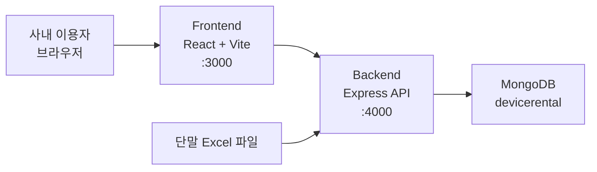
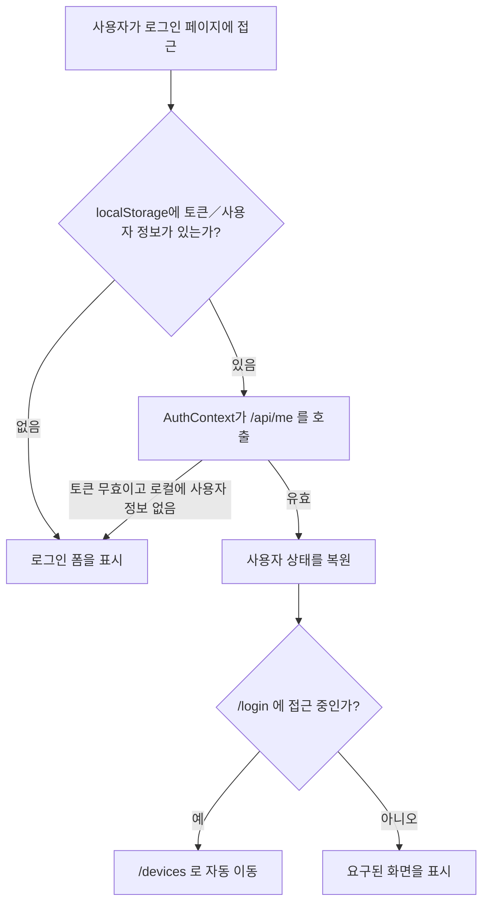
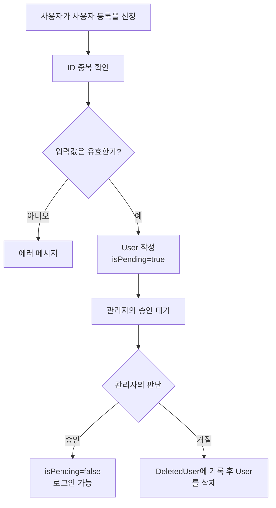
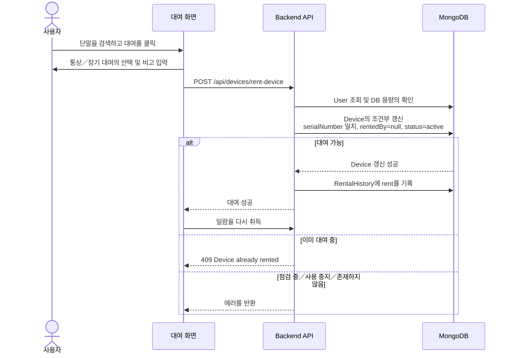
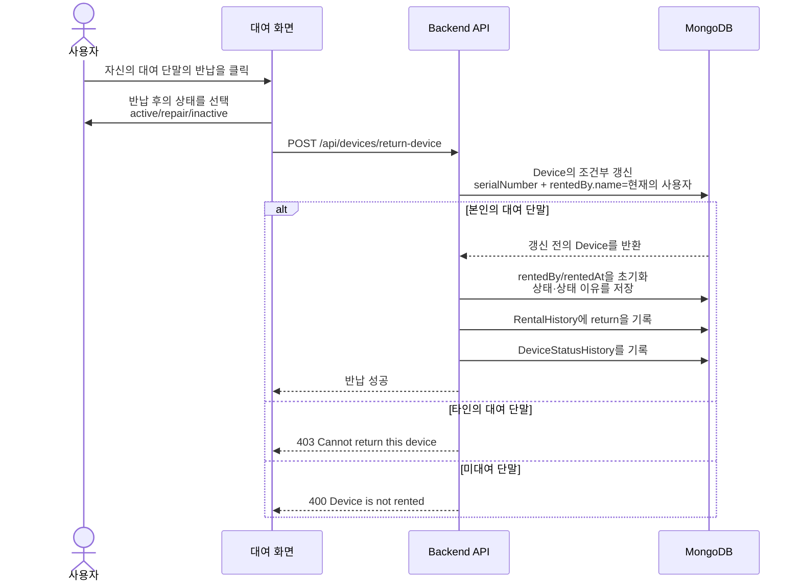
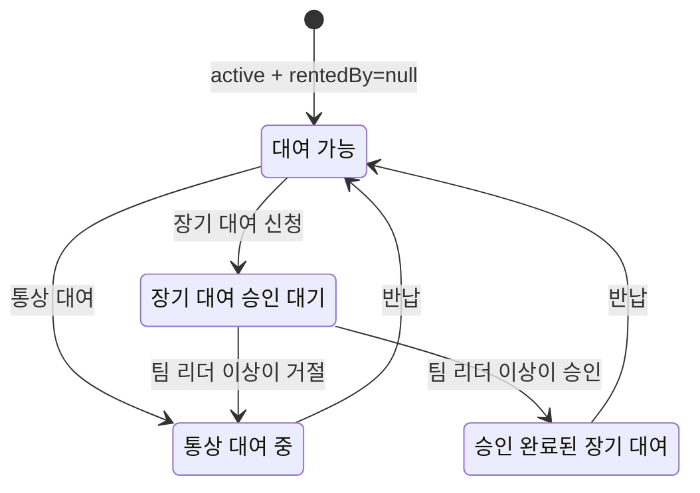
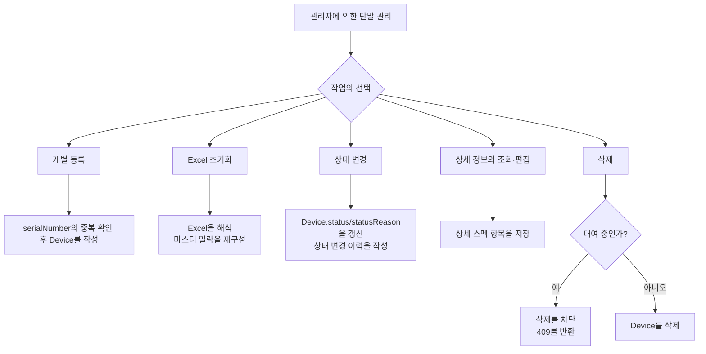

[日本語](DeviceRent_ReverseSpec_ja.md) | [한국어](DeviceRent_ReverseSpec_ko.md)

# DeviceRent 역기획서

작성자: ユ・ギヒョン  
작성일: 2026-06-16  
대상 소스: 현행 `main` 브랜치  
상정 독자: 운용 관리자, 개발·QA 담당자

## 1. 본서의 목적

본서는 현재 구현되어 있는 DeviceRent 시스템을 기준으로, 서비스의 목적, 사용자 권한, 주요 업무 플로우, 데이터 구조, API, 운용 정책을 역기획의 관점에서 정리한 것입니다. 신규 운용자의 온보딩, 기능 검수, 릴리스 승인, 향후 개선 범위의 산정에 활용할 수 있도록 비즈니스 로직을 중심으로 기술합니다.

## 2. 서비스 개요

DeviceRent는 사내 QA 조직에서의 모바일 단말 대여, 반납, 상황 조회, 장기 대여의 승인, 기자재 관리, 대여 이력의 보관을 지원하는 웹 기반 자산 운용 시스템입니다.

주요 목표는 다음과 같습니다.

- 단말별 현재의 대여 가능 여부를 실시간에 가까운 형태로 확인할 수 있게 합니다.
- 사용자가 필요한 단말을 스스로 검색하고, 직접 대여·반납할 수 있게 합니다.
- 관리자가 전체 단말의 일람, 상태, 상세 스펙, Excel 기반의 마스터 데이터를 관리할 수 있게 합니다.
- 팀 리더 이상의 권한자가 장기 대여의 신청을 승인 또는 거절할 수 있게 합니다.
- 대여·반납·상태 변경의 이력을 보존하고, 필요에 따라 Excel로 출력할 수 있게 합니다.

## 3. 사용자와 권한

| 구분 | 주요 권한 | 접근 화면 |
| --- | --- | --- |
| 미승인 사용자 | 사용자 등록 신청, ID 중복 확인 | 사용자 등록, 로그인 |
| 일반 사용자 | 로그인, 단말 검색, 대여, 자신이 대여 중인 단말의 반납, 대여 상황·이력의 조회 | 대여, 대여 상황, 대여 이력 |
| 관리자 | 일반 사용자의 권한 + 사용자의 승인·삭제, 단말의 등록·삭제·상태 변경·상세 정보 편집, Excel 초기화, 이력 익스포트 | 관리자, 단말 관리, 사용자 관리, 대시보드 |
| 팀 리더 이상 | 장기 대여의 승인·거절 | 승인 대기 |

권한은 사용자의 `position`, `roleLevel`, `isAdmin` 으로 관리합니다.

- 관리자 API는 `adminAuth` 미들웨어에 의해 `isAdmin=true` 인 사용자를 요구합니다.
- 장기 대여 승인 API는 `requireRoleLevel(3)` 에 의해 팀 리더 이상의 사용자를 요구합니다.
- 로그인 토큰은 JWT이며, 유효 기간은 관리자 토큰이 365일, 일반 사용자 토큰이 1시간입니다.

## 4. 시스템 구성



Docker Compose의 구성:

- `frontend`: React/Vite 앱, 외부 공개 포트 `3000`
- `backend`: Express API, 외부 공개 포트 `4000`
- `mongo`: 내부 네트워크 전용, 외부에 `27017` 을 공개하지 않음
- `mongo-data`: MongoDB의 영속화 볼륨

## 5. 주요 화면

| 화면 | 경로 | 주요 기능 |
| --- | --- | --- |
| 로그인 | `/login` | 로그인. 로그인이 완료된 사용자는 `/devices` 로 자동 이동 |
| 사용자 등록 | `/register` | 이름, 소속, ID, 패스워드, 직위의 입력, ID 중복 확인 |
| 대여 | `/devices` | 전체／대여 가능／대여 중／자신의 대여 요약, 단말 검색, 대여·반납, 상세 정보의 조회 |
| 대여 상황 | `/devices/status` | 현재 대여 중인 단말 일람, 요약 카드, 비고의 조회 |
| 대여 이력 | `/devices/history` | 대여·반납 이력의 조회 및 기간 지정 익스포트 |
| 관리자 홈 | `/admin` | 관리자 기능으로의 진입, 보존 기간을 넘긴 이력의 정리 |
| 단말 관리 | `/devices/manage` | 단말의 등록·삭제·상태 변경·상세 정보 편집·Excel 초기화 |
| 사용자 관리 | `/admin/users`, `/admin/pending` | 승인된 사용자의 조회, 등록의 승인·거절, 사용자 삭제 |
| 대시보드 | `/dashboard` | 보유 총수, 대여 중, 장기 대여, 점검·사용 중지, 반납 지연의 집계 |
| 장기 대여 승인 | `/longterm/approvals` | 장기 대여 신청의 승인·거절 |

## 6. 주요 업무 플로우

### 6.1 로그인 및 세션 유지



업무 규칙:

- 로그인 성공 시에 JWT를 저장하고, `/api/me` 로 사용자 정보를 다시 취득합니다.
- 앱 초기화 시, 저장된 토큰이 있으면 `/api/me` 로 유효성을 검증합니다.
- 로그인이 완료된 사용자가 `/login` 에 접근한 경우에는 대여 페이지로 이동합니다.
- 모바일에서 로그인한 사용자는 `/mobile/rent` 로 이동합니다.

### 6.2 사용자 등록 및 승인



업무 규칙:

- 등록 시에는 이름, 소속, ID, 패스워드, 패스워드 확인, 직위가 모두 필수입니다.
- ID는 3자 이상, 패스워드는 6자 이상으로 합니다.
- 등록 직후의 계정은 `isPending=true` 이며, 로그인할 수 없습니다.
- 관리자가 승인함으로써 정상적으로 로그인할 수 있게 됩니다.
- 거절·삭제된 사용자는 삭제 이유와 함께 `DeletedUser` 에 기록됩니다.

### 6.3 단말의 대여



업무 규칙:

- 대여는 `status=active` 이고 `rentedBy=null` 인 단말에 한해 가능합니다.
- 서버는 `findOneAndUpdate` 에 의한 조건부 갱신으로 이중 대여를 방지합니다.
- 대여 성공 시에 `Device.rentedBy`, `rentedAt`, `remark`, `rentalType`, `longTermStatus` 가 갱신됩니다.
- 통상 대여는 `rentalType=normal`, `longTermStatus=none` 이 됩니다.
- 장기 대여는 단말을 즉시 대여 상태로 한 뒤, `rentalType=longterm`, `longTermStatus=pending` 의 승인 대기 상태가 됩니다.
- 대여 성공 시에 `RentalHistory` 에 `action=rent` 의 기록이 작성됩니다.

### 6.4 단말의 반납



업무 규칙:

- 사용자는 본인 명의로 대여되어 있는 단말만 반납할 수 있습니다.
- 반납 시, 단말의 대여 정보는 초기화되고, 장기 대여의 상태도 통상 상태로 돌아갑니다.
- 반납 후의 상태는 `active`, `repair`, `inactive` 중 하나로 저장됩니다.
- 반납은 `RentalHistory`, 상태 변경은 `DeviceStatusHistory` 에 각각 기록됩니다.

### 6.5 장기 대여의 승인



업무 규칙:

- 장기 대여의 신청자는 일반 사용자와 동일하게 단말을 대여하지만, 승인될 때까지는 `pending` 이 됩니다.
- 팀 리더 이상은 승인 대기 일람에서 승인·거절을 할 수 있습니다.
- 승인 시에는 `longTermStatus=approved`, `approvedBy`, `approvedAt` 이 저장됩니다.
- 거절 시에는 실제 대여를 유지한 채, `rentalType=normal`, `longTermStatus=none` 으로 되돌립니다.
- 대시보드에서의 72시간 초과 반납 지연의 집계에서는, 승인이 완료된 장기 대여를 제외합니다.

### 6.6 단말 관리



업무 규칙:

- 관리자는 단말을 개별로 등록하거나, Excel 파일로 초기화할 수 있습니다.
- Excel 초기화에서는 운용 중인 Excel 대장의 주요 시트에서 시리얼, 단말명, OS, 단말 상태, 상세 스펙을 읽어들입니다.
- Excel상의 단말 상태는 시스템상의 상태로 변환됩니다.
  - 이용 가능: `active`
  - 수리: `repair`
  - 폐기／대여 대상 외: `inactive`
- 상세 정보에는 단말 상태, 구분, 제조사, 모델 번호, 칩셋, CPU, GPU, 메모리, Bluetooth, 화면 크기, 해상도, 등록일, 확인일, UDID, 비고가 포함됩니다.
- 대여 중인 단말은 삭제할 수 없습니다. 백엔드에서는 `rentedBy=null` 을 조건으로 한 경우에만 삭제하기 때문에, 화면을 경유하지 않는 요청도 차단됩니다.
- 관리 페이지의 상세 정보 모달은, 조회 후에 편집 버튼을 누른 경우에만 편집 상태가 됩니다.
- 대여 페이지의 상세 정보 모달은 조회 전용입니다.

## 7. 데이터 모델

### 7.1 Device

| 필드 | 의미 |
| --- | --- |
| `serialNumber` | 단말의 고유 식별자 |
| `deviceInfo`, `modelName` | 표시용 단말명／모델명 |
| `osName`, `osVersion` | OS의 종류 및 버전 |
| `rentedBy` | 현재 대여자의 이름／소속, 미대여 시에는 `null` |
| `rentedAt` | 현재의 대여 개시 일시 |
| `rentalType` | `normal` 또는 `longterm` |
| `longTermStatus` | `none`, `pending`, `approved` |
| `approvedBy`, `approvedAt` | 장기 대여의 승인자／승인 일시 |
| `status` | `active`, `repair`, `inactive` |
| `statusReason` | 상태 변경의 이유 |
| `remark` | 대여 시의 비고 |
| `details` | Excel 기반의 상세 스펙 |

### 7.2 User

| 필드 | 의미 |
| --- | --- |
| `id` | 로그인 ID |
| `password` | bcrypt로 해시화한 패스워드 |
| `name`, `affiliation` | 사용자의 이름／소속 |
| `position` | 직위 |
| `roleLevel` | 권한 레벨(값이 작을수록 상위 권한) |
| `isPending` | 관리자의 승인 대기인지 여부 |
| `isAdmin` | 관리자 권한의 유무 |

### 7.3 RentalHistory

| 필드 | 의미 |
| --- | --- |
| `deviceId`, `serialNumber` | 대상 단말 |
| `userId`, `userDetails` | 대여·반납을 수행한 사용자 |
| `action` | `rent` 또는 `return` |
| `timestamp` | 실행 일시 |
| `deviceInfo` | 당시의 단말명／OS 정보 |
| `remark` | 대여 시의 비고 |

### 7.4 DeviceStatusHistory

| 필드 | 의미 |
| --- | --- |
| `serialNumber` | 대상 단말 |
| `modelName`, `osName`, `osVersion` | 당시의 단말 정보 |
| `status` | 변경 후의 상태 |
| `statusReason` | 상태 변경의 이유 |
| `performedBy` | 실행자 |
| `timestamp` | 실행 일시 |

## 8. 주요 API

| 구분 | Method/Path | 용도 | 권한 |
| --- | --- | --- | --- |
| 인증 | `POST /api/auth/register` | 사용자 등록 신청 | 공개 |
| 인증 | `POST /api/auth/check-id` | ID 중복 확인 | 공개 |
| 인증 | `POST /api/auth/login` | 로그인 및 JWT 발행 | 공개 |
| 인증 | `GET /api/me` | 현재 사용자의 검증 | 로그인 |
| 단말 | `GET /api/devices` | 전체 단말 일람 | 로그인 |
| 단말 | `GET /api/devices/available` | 대여 가능 단말 일람 | 로그인 |
| 단말 | `GET /api/devices/status` | 현재 대여 중인 단말 일람 | 로그인 |
| 대여 | `POST /api/devices/rent-device` | 단말의 대여 | 로그인 |
| 반납 | `POST /api/devices/return-device` | 단말의 반납 | 로그인 |
| 이력 | `GET /api/devices/history` | 대여·반납 이력의 조회 | 로그인 |
| 이력 | `POST /api/devices/history/export` | 이력의 Excel 익스포트 | 로그인 |
| 관리자 | `POST /api/admin/upload-devices` | Excel에 의한 단말 초기화 | 관리자 |
| 관리자 | `POST /api/devices/manage/register` | 단말의 개별 등록 | 관리자 |
| 관리자 | `POST /api/devices/manage/delete` | 단말의 삭제 | 관리자 |
| 관리자 | `POST /api/devices/manage/update-details` | 상세 정보의 편집 | 관리자 |
| 관리자 | `POST /api/devices/manage/update-status` | 단말의 상태 변경 | 로그인 토큰(화면상으로는 관리자) |
| 관리자 | `GET /api/admin/users/pending` | 등록 승인 대기의 조회 | 관리자 |
| 관리자 | `POST /api/admin/users/approve` | 사용자의 승인 | 관리자 |
| 관리자 | `POST /api/admin/users/reject` | 사용자의 거절 | 관리자 |
| 관리자 | `POST /api/admin/users/delete` | 사용자의 삭제 | 관리자 |
| 대시보드 | `GET /api/devices/dashboard` | 운용 지표의 조회 | 관리자 |
| 장기 대여 | `GET /api/devices/longterm/pending` | 장기 대여의 승인 대기 조회 | 팀 리더 이상 |
| 장기 대여 | `POST /api/devices/longterm/approve` | 장기 대여의 승인 | 팀 리더 이상 |
| 장기 대여 | `POST /api/devices/longterm/reject` | 장기 대여의 거절 | 팀 리더 이상 |

## 9. 운용 지표의 정의

| 지표 | 정의 |
| --- | --- |
| 전체 | Device의 총수 |
| 대여 가능 | `status=active` 이고 `rentedBy=null` 인 단말 |
| 대여 중 | `rentedBy` 가 존재하는 단말 |
| 자신의 대여 | 로그인 사용자의 이름과 `rentedBy.name` 이 일치하는 단말 |
| 점검 중／사용 중지 | `status=repair` 또는 `status=inactive` 인 단말 |
| 장기 대여(승인 완료) | `rentalType=longterm`, `longTermStatus=approved` |
| 장기 대여(승인 대기) | `rentalType=longterm`, `longTermStatus=pending` |
| 반납 지연 | 대여로부터 72시간 이상 경과하고, 승인이 완료된 장기 대여가 아닌 것 |

## 10. 예외 처리 및 통제 정책

| 상황 | 처리 |
| --- | --- |
| 토큰 없음 | 401을 반환하고, 프런트엔드는 로그인 화면으로 이동 |
| 토큰 무효 | 401 또는 403을 반환 |
| 미승인 사용자의 로그인 | 403, 승인 대기 메시지를 표시 |
| 대여 중인 단말에 대한 대여 | 409를 반환 |
| 점검 중／사용 중지 단말에 대한 대여 | 400을 반환 |
| 타인이 대여 중인 단말의 반납 | 403을 반환 |
| 대여 중인 단말의 삭제 | 409를 반환하고 삭제를 차단 |
| DB 사용률 95% 초과 | 대여·반납 처리를 503으로 차단 |
| Excel 파일 없음 | 400을 반환 |
| 상세 정보의 편집 대상 없음 | 404를 반환 |

## 11. 빌드 및 검증 결과

2026-06-16 시점의 소스를 기준으로 아래의 검증을 실시했습니다.

| 항목 | 결과 |
| --- | --- |
| Frontend Vite 프로덕션 빌드 | 성공 |
| Backend 문법 체크 | 성공 |
| Backend 관리·삭제의 회귀 테스트 | 성공(7건의 테스트가 통과) |
| Docker Compose 이미지 빌드 | 성공(`frontend`／`backend` 이미지의 빌드 완료) |

프런트엔드의 빌드 명령:

```powershell
npm.cmd run build
```

백엔드의 검증 명령:

```powershell
node --check server.js
node --check routes/devices.js
node --check routes/auth.js
node --check routes/admin/users.js
$env:JWT_SECRET='<your-test-secret>'
npx.cmd jest tests/routes/devices/devices-other.test.js --runInBand --coverage=false
```

Docker 이미지의 빌드 명령:

```powershell
docker compose build frontend backend
```

## 12. 현행 구현에서의 유의점

- 대여 가능 여부는 서버 측의 조건부 갱신에 의해 최종적으로 판정되기 때문에, 여러 사용자가 동시에 같은 단말을 대여하려고 해도 이중 대여는 방지됩니다.
- 대여 상황 페이지는 대여 중인 일람을 표시하지만, 요약 카드는 전체 단말 일람도 함께 취득해서 산출합니다.
- Excel 초기화 기능은 운용 중인 마스터 데이터를 시스템의 기준 데이터로 재구성하는 기능이므로, 적용 전에 파일의 검수가 필요합니다.
- MongoDB는 Compose 구성상 외부 포트를 공개하지 않고, 내부 서비스 간의 통신만을 허가하고 있습니다.
